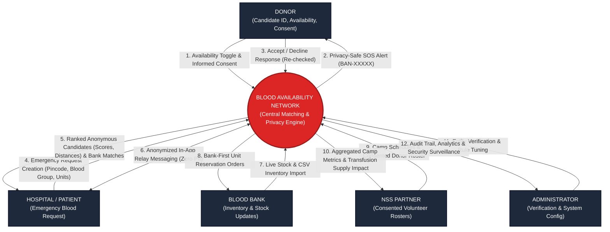

# Data Flow Diagram (DFD) — Level 0: Context Diagram

```mermaid
graph TD
    classDef actor fill:#1E293B,stroke:#0F172A,stroke-width:2px,color:#FFFFFF;
    classDef system fill:#DC2626,stroke:#991B1B,stroke-width:3px,color:#FFFFFF;

    DONOR["DONOR\n(Candidate ID, Availability, Consent)"]:::actor
    HOSPITAL["HOSPITAL / PATIENT\n(Emergency Blood Request)"]:::actor
    BLOOD_BANK["BLOOD BANK\n(Inventory & Stock Updates)"]:::actor
    NSS["NSS PARTNER\n(Consented Volunteer Rosters)"]:::actor
    ADMIN["ADMINISTRATOR\n(Verification & System Config)"]:::actor

    BAN(("BLOOD AVAILABILITY NETWORK\n(Central Matching & Privacy Engine)")):::system

    %% Donor Flow
    DONOR -->|"1. Availability Toggle & Informed Consent"| BAN
    BAN -->|"2. Privacy-Safe SOS Alert (BAN-XXXXX)"| DONOR
    DONOR -->|"3. Accept / Decline Response (Re-checked)"| BAN

    %% Hospital / Patient Flow
    HOSPITAL -->|"4. Emergency Request Creation (Pincode, Blood Group, Units)"| BAN
    BAN -->|"5. Ranked Anonymous Candidates (Scores, Distances) & Bank Matches"| HOSPITAL
    HOSPITAL <-->|"6. Anonymized In-App Relay Messaging (Zero PII)"| BAN

    %% Blood Bank Flow
    BLOOD_BANK -->|"7. Live Stock & CSV Inventory Import"| BAN
    BAN -->|"8. Bank-First Unit Reservation Orders"| BLOOD_BANK

    %% NSS Flow
    NSS -->|"9. Camp Schedules & Consented Donor Roster"| BAN
    BAN -->|"10. Aggregated Camp Metrics & Transfusion Supply Impact"| NSS

    %% Admin Flow
    ADMIN -->|"11. Entity Verification & Rule Tuning"| BAN
    BAN -->|"12. Audit Trail, Analytics & Security Surveillance"| ADMIN
```
