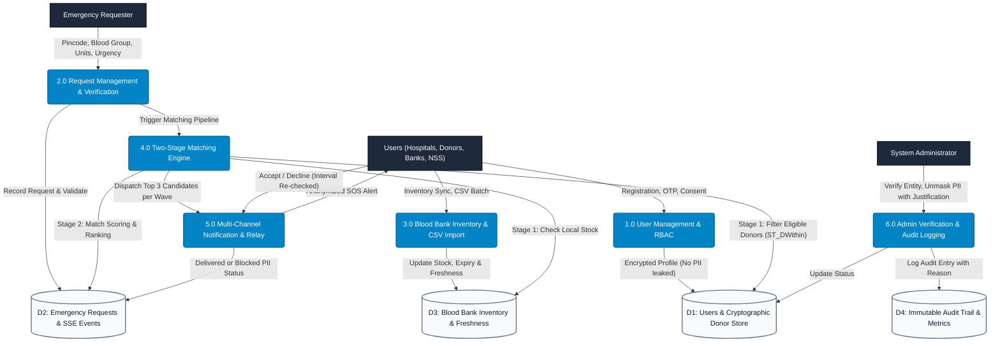

# Data Flow Diagram (DFD) — Level 1: Subsystem Processes

```mermaid
graph TD
    classDef process fill:#0284C7,stroke:#0369A1,stroke-width:2px,color:#FFFFFF;
    classDef datastore fill:#F8FAFC,stroke:#64748B,stroke-width:2px,color:#0F172A;
    classDef external fill:#1E293B,stroke:#0F172A,stroke-width:2px,color:#FFFFFF;

    USER["Users (Hospitals, Donors, Banks, NSS)"]:::external
    EMERGENCY["Emergency Requester"]:::external
    ADMIN["System Administrator"]:::external

    P1("1.0 User Management & RBAC"):::process
    P2("2.0 Request Management & Verification"):::process
    P3("3.0 Blood Bank Inventory & CSV Import"):::process
    P4("4.0 Two-Stage Matching Engine"):::process
    P5("5.0 Multi-Channel Notification & Relay"):::process
    P6("6.0 Admin Verification & Audit Logging"):::process

    D1[("D1: Users & Cryptographic Donor Store")]:::datastore
    D2[("D2: Emergency Requests & SSE Events")]:::datastore
    D3[("D3: Blood Bank Inventory & Freshness")]:::datastore
    D4[("D4: Immutable Audit Trail & Metrics")]:::datastore

    USER -->|"Registration, OTP, Consent"| P1
    P1 -->|"Encrypted Profile (No PII leaked)"| D1

    EMERGENCY -->|"Pincode, Blood Group, Units, Urgency"| P2
    P2 -->|"Record Request & Validate"| D2
    P2 -->|"Trigger Matching Pipeline"| P4

    USER -->|"Inventory Sync, CSV Batch"| P3
    P3 -->|"Update Stock, Expiry & Freshness"| D3

    P4 -->|"Stage 1: Check Local Stock"| D3
    P4 -->|"Stage 1: Filter Eligible Donors (ST_DWithin)"| D1
    P4 -->|"Stage 2: Match Scoring & Ranking"| D2
    P4 -->|"Dispatch Top 3 Candidates per Wave"| P5

    P5 -->|"Anonymized SOS Alert"| USER
    USER -->|"Accept / Decline (Interval Re-checked)"| P5
    P5 -->|"Delivered or Blocked PII Status"| D2

    ADMIN -->|"Verify Entity, Unmask PII with Justification"| P6
    P6 -->|"Log Audit Entry with Reason"| D4
    P6 -->|"Update Status"| D1
```
