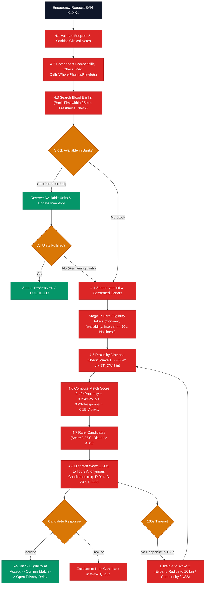

# Data Flow Diagram (DFD) — Level 2: Matching Engine Pipeline

```mermaid
graph TD
    classDef startnode fill:#0F172A,stroke:#020617,stroke-width:2px,color:#FFFFFF;
    classDef step fill:#DC2626,stroke:#B91C1C,stroke-width:2px,color:#FFFFFF;
    classDef decision fill:#D97706,stroke:#B45309,stroke-width:2px,color:#FFFFFF;
    classDef success fill:#059669,stroke:#047857,stroke-width:2px,color:#FFFFFF;

    REQ["Emergency Request BAN-XXXXX"]:::startnode
    V1["4.1 Validate Request & Sanitize Clinical Notes"]:::step
    V2["4.2 Component Compatibility Check (Red Cells/Whole/Plasma/Platelets)"]:::step
    V3["4.3 Search Blood Banks (Bank-First within 25 km, Freshness Check)"]:::step

    B_STOCK{"Stock Available in Bank?"}:::decision
    RESERVE["Reserve Available Units & Update Inventory"]:::success
    CHECK_FULL{"All Units Fulfilled?"}:::decision

    SEARCH_DONORS["4.4 Search Verified & Consented Donors"]:::step
    HARD_FILTERS["Stage 1: Hard Eligibility Filters (Consent, Availability, Interval >= 90d, No illness)"]:::step
    DIST_FILTER["4.5 Proximity Distance Check (Wave 1: <= 5 km via ST_DWithin)"]:::step
    SCORE_CALC["4.6 Compute Match Score:\n0.40×Proximity + 0.25×Group + 0.20×Response + 0.15×Activity"]:::step
    RANK_CANDIDATES["4.7 Rank Candidates (Score DESC, Distance ASC)"]:::step
    NOTIFY_WAVE["4.8 Dispatch Wave 1 SOS to Top 3 Anonymous Candidates (e.g. D-014, D-207, D-092)"]:::step

    RESP{"Candidate Response"}:::decision
    ACCEPT["Re-Check Eligibility at Accept -> Confirm Match -> Open Privacy Relay"]:::success
    DECLINE["Escalate to Next Candidate in Wave Queue"]:::step
    TIMEOUT{"180s Timeout"}:::decision
    EXPAND["Escalate to Wave 2 (Expand Radius to 10 km / Community / NSS)"]:::step

    REQ --> V1
    V1 --> V2
    V2 --> V3
    V3 --> B_STOCK
    B_STOCK -- "Yes (Partial or Full)" --> RESERVE
    RESERVE --> CHECK_FULL
    CHECK_FULL -- "Yes" --> FULFILLED["Status: RESERVED / FULFILLED"]:::success
    CHECK_FULL -- "No (Remaining Units)" --> SEARCH_DONORS
    B_STOCK -- "No Stock" --> SEARCH_DONORS

    SEARCH_DONORS --> HARD_FILTERS
    HARD_FILTERS --> DIST_FILTER
    DIST_FILTER --> SCORE_CALC
    SCORE_CALC --> RANK_CANDIDATES
    RANK_CANDIDATES --> NOTIFY_WAVE

    NOTIFY_WAVE --> RESP
    RESP -- "Accept" --> ACCEPT
    RESP -- "Decline" --> DECLINE
    NOTIFY_WAVE --> TIMEOUT
    TIMEOUT -- "No Response in 180s" --> EXPAND
    EXPAND --> DIST_FILTER
```
