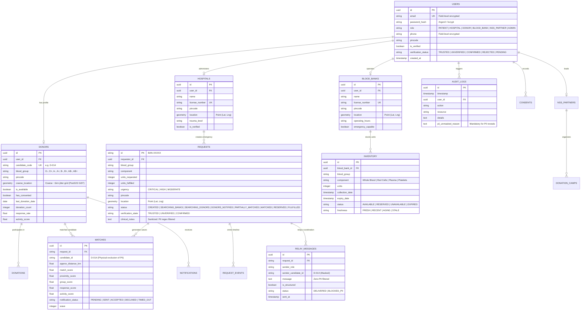

# Entity-Relationship (ER) Diagram

```mermaid
erDiagram
    USERS ||--o| DONORS : "has profile"
    USERS ||--o| HOSPITALS : "administers"
    USERS ||--o| BLOOD_BANKS : "operates"
    USERS ||--o| NSS_PARTNERS : "leads"
    USERS ||--o{ AUDIT_LOGS : "triggers"
    USERS ||--o{ CONSENTS : "records"

    DONORS ||--o{ DONATIONS : "participates in"
    DONORS ||--o{ MATCHES : "matched candidate"
    DONORS ||--o{ NOTIFICATIONS : "receives"

    HOSPITALS ||--o{ REQUESTS : "creates emergency"
    BLOOD_BANKS ||--o{ INVENTORY : "stocks units"
    NSS_PARTNERS ||--o{ DONATION_CAMPS : "organizes"

    REQUESTS ||--o{ MATCHES : "generates waves"
    REQUESTS ||--o{ REQUEST_EVENTS : "emits timeline"
    REQUESTS ||--o{ RELAY_MESSAGES : "relays coordination"

    USERS {
        uuid id PK
        string email UK "Field-level encrypted"
        string password_hash "Argon2 / bcrypt"
        string role "PATIENT | HOSPITAL | DONOR | BLOOD_BANK | NSS_PARTNER | ADMIN"
        string phone "Field-level encrypted"
        string pincode
        boolean is_verified
        string verification_status "TRUSTED | UNVERIFIED | CONFIRMED | REJECTED | PENDING"
        timestamp created_at
    }

    DONORS {
        uuid id PK
        uuid user_id FK
        string candidate_code UK "e.g. D-014"
        string blood_group "O-, O+, A-, A+, B-, B+, AB-, AB+"
        string pincode
        geometry coarse_location "Coarse ~1km jitter grid (PostGIS GiST)"
        boolean is_available
        boolean has_consented
        date last_donation_date
        integer donation_count
        float response_rate
        float activity_score
    }

    HOSPITALS {
        uuid id PK
        uuid user_id FK
        string name
        string license_number UK
        string pincode
        geometry location "Point (Lat, Lng)"
        string trauma_level
        boolean is_verified
    }

    BLOOD_BANKS {
        uuid id PK
        uuid user_id FK
        string name
        string license_number UK
        string pincode
        geometry location "Point (Lat, Lng)"
        string operating_hours
        boolean emergency_capable
    }

    INVENTORY {
        uuid id PK
        uuid blood_bank_id FK
        string blood_group
        string component "Whole Blood | Red Cells | Plasma | Platelets"
        integer units
        timestamp collection_date
        timestamp expiry_date
        string status "AVAILABLE | RESERVED | UNAVAILABLE | EXPIRED"
        string freshness "FRESH | RECENT | AGING | STALE"
    }

    REQUESTS {
        string id PK "BAN-XXXXX"
        uuid requester_id FK
        string blood_group
        string component
        integer units_requested
        integer units_fulfilled
        string urgency "CRITICAL | HIGH | MODERATE"
        string pincode
        geometry location "Point (Lat, Lng)"
        string status "CREATED | SEARCHING_BANKS | SEARCHING_DONORS | DONORS_NOTIFIED | PARTIALLY_MATCHED | MATCHED | RESERVED | FULFILLED"
        string verification_state "TRUSTED | UNVERIFIED | CONFIRMED"
        text clinical_notes "Sanitized: PII regex filtered"
    }

    MATCHES {
        uuid id PK
        string request_id FK
        string candidate_id "D-014 (Physical exclusion of PII)"
        float approx_distance_km
        float match_score
        float proximity_score
        float group_score
        float response_score
        float activity_score
        string notification_status "PENDING | SENT | ACCEPTED | DECLINED | TIMED_OUT"
        integer wave
    }

    RELAY_MESSAGES {
        uuid id PK
        string request_id FK
        string sender_role
        string sender_candidate_id "D-014 (Masked)"
        text message "Zero-PII filtered"
        boolean is_structured
        string status "DELIVERED | BLOCKED_PII"
        timestamp sent_at
    }

    AUDIT_LOGS {
        uuid id PK
        timestamp timestamp
        uuid user_id FK
        string action
        string resource
        text details
        text pii_unmasked_reason "Mandatory for PII reveals"
    }
```
