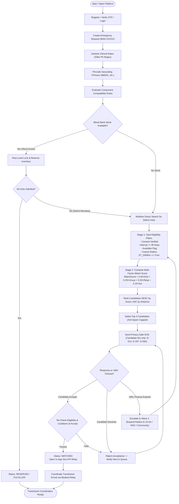

# System Flowchart

```mermaid
flowchart TD
    START(["Start / Open Platform"]) --> ROLE_AUTH["Register / Verify OTP / Login"]
    ROLE_AUTH --> REQ_CREATE["Create Emergency Request (BAN-XXXXX)"]
    REQ_CREATE --> NOTE_SANITIZE["Sanitize Clinical Notes (Filter PII Regex)"]
    NOTE_SANITIZE --> PIN_LOOKUP["Pincode Geocoding (Thrissur 680001, etc.)"]
    PIN_LOOKUP --> COMPAT["Evaluate Component Compatibility Rules"]
    COMPAT --> CHECK_BANK{"Blood Bank Stock Available?"}

    CHECK_BANK -- "Yes (Stock Exists)" --> BANK_RESERVE["Row-Level Lock & Reserve Inventory"]
    BANK_RESERVE --> CHECK_DEFICIT{"All Units Satisfied?"}
    CHECK_DEFICIT -- "Yes" --> BANK_FULFILL["Status: RESERVED / FULFILLED"]
    BANK_FULFILL --> END_OK(["Transfusion Coordination Ready"])

    CHECK_DEFICIT -- "No (Deficit Remains)" --> DONOR_SEARCH["Mobilize Donor Search for Deficit Units"]
    CHECK_BANK -- "No Stock" --> DONOR_SEARCH

    DONOR_SEARCH --> HARD_FILTER["Stage 1: Hard Eligibility Filters\n- Consent Verified\n- Interval >= 90 Days\n- Available Flag\n- Coarse Radius ST_DWithin <= 5 km"]
    HARD_FILTER --> MATCH_SCORE["Stage 2: Compute Multi-Factor Match Score\nMatchScore = 0.40×Dist + 0.25×Group + 0.20×Resp + 0.15×Act"]
    MATCH_SCORE --> RANK_SORT["Rank Candidates DESC by Score, ASC by Distance"]
    RANK_SORT --> WAVE_CAP["Select Top 3 Candidates (Anti-Spam Capped)"]
    WAVE_CAP --> DISPATCH_SOS["Send Privacy-Safe SOS (Candidate IDs only: D-014, D-207, D-092)"]

    DISPATCH_SOS --> TIMER_WAIT{"Response or 180s Timeout?"}

    TIMER_WAIT -- "Candidate Accepts" --> RECHECK_ELIGIBILITY{"Re-Check Eligibility & Cooldown at Accept"}
    RECHECK_ELIGIBILITY -- "Passes" --> MATCH_CONFIRM["Status: MATCHED\nOpen In-App Zero-PII Relay"]
    RECHECK_ELIGIBILITY -- "Fails" --> ESCALATE_NEXT["Reject Acceptance -> Notify Next in Queue"]

    TIMER_WAIT -- "Candidate Declines" --> ESCALATE_NEXT
    ESCALATE_NEXT --> DISPATCH_SOS

    TIMER_WAIT -- "180s Timeout Expired" --> ESCALATE_RADIUS["Escalate to Wave 2 (Expand Radius to 10 km / NSS / Community)"]
    ESCALATE_RADIUS --> HARD_FILTER

    MATCH_CONFIRM --> IN_APP_RELAY["Coordinate Transfusion Arrival via Masked Relay"]
    IN_APP_RELAY --> END_OK
```
